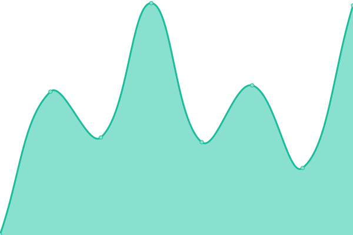

# [📈 Live Status](https://demo.upptime.js.org): <!--live status--> **🟧 Partial outage**

This repository contains the open-source uptime monitor and status page for [Alberto Ferro](www.purosoft.net), powered by [Upptime](https://github.com/upptime/upptime).

With [Upptime](https://upptime.js.org), you can get your own unlimited and free uptime monitor and status page, powered entirely by a GitHub repository. We use [Issues](https://github.com/albertoferro/status/issues) as incident reports, [Actions](https://github.com/albertoferro/status/actions) as uptime monitors, and [Pages](https://demo.upptime.js.org) for the status page.

<!--start: status pages-->
<!-- This summary is generated by Upptime (https://github.com/upptime/upptime) -->
<!-- Do not edit this manually, your changes will be overwritten -->
<!-- prettier-ignore -->
| URL | Status | History | Response Time | Uptime |
| --- | ------ | ------- | ------------- | ------ |
|  [Dealmaker](https://app.dealmaker.tech/) | 🟩 Up | [dealmaker.yml](https://github.com/albertoferro/status/commits/HEAD/history/dealmaker.yml) | 

 160ms
     
 | 

<a href="https://albertoferro.github.io/status/history/dealmaker">100.00%</a>
    

|  [Dev2](https://dev2.dealmaker-dev.com) | 🟥 Down | [dev2.yml](https://github.com/albertoferro/status/commits/HEAD/history/dev2.yml) | 

 147ms
     
 | 

<a href="https://albertoferro.github.io/status/history/dev2">0.00%</a>
    

|  [Dev 3](https://dev3.dealmaker-dev.com) | 🟥 Down | [dev-3.yml](https://github.com/albertoferro/status/commits/HEAD/history/dev-3.yml) | 

 134ms
     
 | 

<a href="https://albertoferro.github.io/status/history/dev-3">0.09%</a>
    

|  [Test Broken Site](https://thissitedoesnotexist.koj.co) | 🟥 Down | [test-broken-site.yml](https://github.com/albertoferro/status/commits/HEAD/history/test-broken-site.yml) | 

 0ms
     
 | 

<a href="https://albertoferro.github.io/status/history/test-broken-site">100.00%</a>
    

<!--end: status pages-->

[**Visit our status website →**](https://demo.upptime.js.org)

## 📄 License

- Powered by: [Upptime](https://github.com/upptime/upptime)
- Code: [MIT](./LICENSE) © [Alberto Ferro](www.purosoft.net)
- Data in the `./history` directory: [Open Database License](https://opendatacommons.org/licenses/odbl/1-0/)
